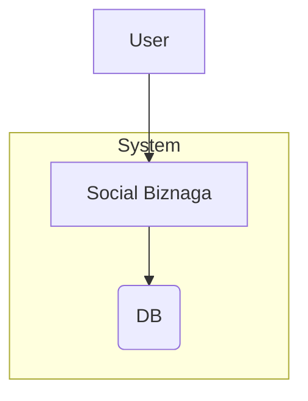
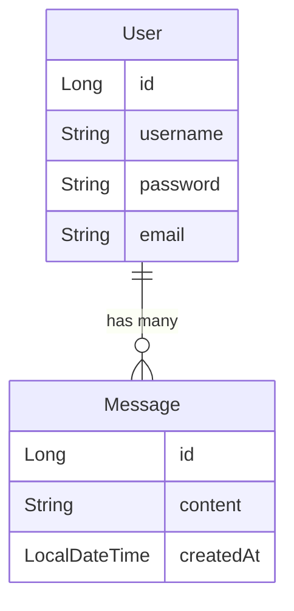

You're reading the step 1 version of the README file. If you want to go to other step, use the corresponding git tag.

# Step 1
This is the simplest of all examples we have. The idea is to deploy our system without any performance consideration and see how it breaks:



The relationship between Users and Messages is defined here:


We have a simple application deployed on a container and a DB deployed on another. The application is exposing endpoints to register, login, create a message, retrieve all messages and retrieve all messages from a given user.

We use [JWT](https://jwt.io/) for authorisation tokens.

To run this step, just run inside this folder (check it has execute permissions, otherwise run chmod 755 on these script files)
```
./setUp.sh
```
This will create all the containers and start the application. When it is up and running you can run
```
./runLoadTest.sh
```

This scenario is adding 1 user every second to the system. The user is doing registration, login, posting 1 message and retrieving messages from other users. When all that is done, the user stops the activity.

You can check the load test results in the console after running the test (a link is provided) and you can also check your product and DB metrics in Grafana and some trace examples in APM by opening http://localhost:5601/app/apm/services/social-biznaga.

To run a breaking load test, just run
```
./runHighLoadTest.sh
```

When you are done, run 
```
./tearDown.sh
```
to destroy all containers

## Check Grafana
Go to http://localhost:3000/login and use admin/admin as credentials (it will as you to change if you wish). The first thing to do in Grafana, if you haven't done, is to setup a Data Source. Go to http://localhost:3000/connections/datasources/new and select Prometheus. Then in the Prometheus url add http://prometheus:9090 and you can click on save and test. 
Now you should create your dashboard, so go to http://localhost:3000/dashboards and click on new > import or go to http://localhost:3000/dashboard/import and then you can upload the spring_board.json file (select your Prometheus source) and save. You can do the same with mysql_board.json to have a MySQL board.
Both dashboards will now appear in http://localhost:3000/dashboards so you can check them.